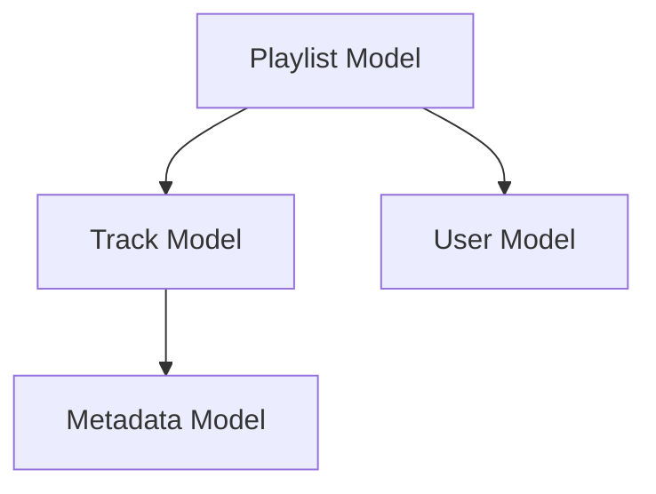
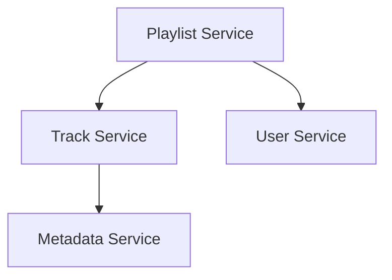
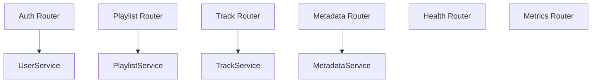
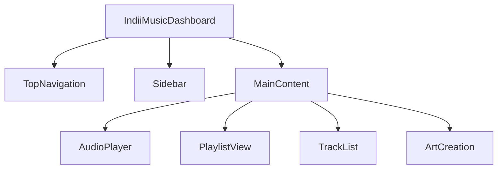
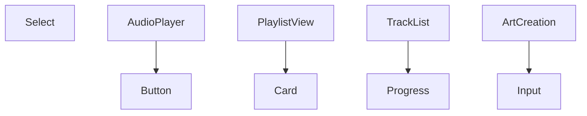
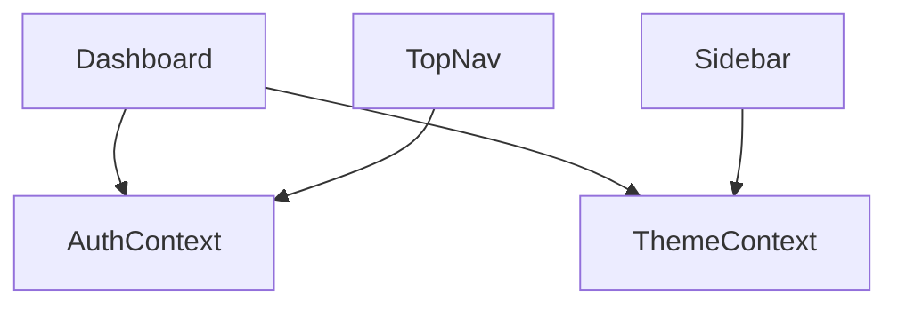
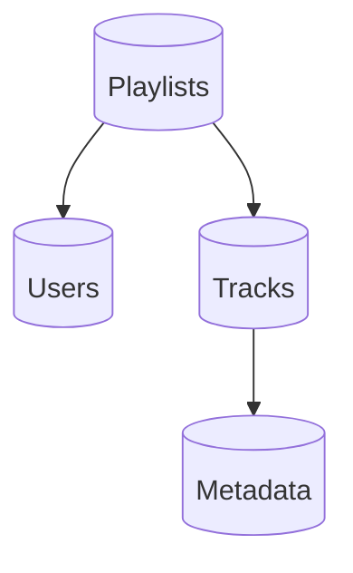

# System Dependency Graph

## Backend Dependencies

### Data Models

### Services Layer

### API Routes

## Frontend Dependencies

### Component Tree

### UI Components

### State Management

## Database Schema

