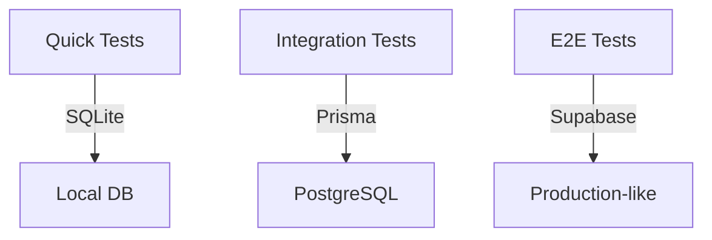

# 🧪 INDII Music Test Infrastructure

## Overview
This document serves as the single source of truth for our test infrastructure, covering everything from setup to examples and best practices.

## Table of Contents
- [Current Status](#current-status)
- [Database Architecture](#database-architecture)
- [Test Environment Setup](#test-environment-setup)
- [Example Test Suites](#example-test-suites)
- [Common Patterns](#common-patterns)
- [Troubleshooting](#troubleshooting)
- [Checklist & Progress](#checklist--progress)

## Current Status

### Environment Components
| Component | Status | Notes |
|-----------|---------|-------|
| SQLite | ✅ Ready | Default for quick tests |
| Prisma/PostgreSQL | ⚠️ Needs Config | Configured but needs connection |
| Supabase | ⚠️ Needs Config | Setup complete, needs test DB |
| Test Utils | ✅ Ready | Factories & assertions done |
| CI Integration | ❌ Pending | GitHub Actions needed |

### Test Coverage
| Module | Coverage | Status |
|--------|-----------|--------|
| VectorStore | 0% | Needs real DB |
| TreeRings Memory | 60% | Partially working |
| Agent System | 0% | Not started |
| Database Adapter | 0% | Not started |

## Database Architecture

### Three-Tier Testing Strategy


### Database Adapter System
```typescript
// TestDatabaseAdapter provides unified interface
class TestDatabaseAdapter {
  private dbType: 'sqlite' | 'prisma' | 'supabase';
  
  // Determine DB type from environment
  constructor() {
    this.dbType = process.env.TEST_DATABASE_TYPE || 'sqlite';
  }
  
  // Example method - consistent across all DBs
  async createMemory(data: MemoryInput): Promise<Memory> {
    switch(this.dbType) {
      case 'sqlite':
        return this.createMemorySQLite(data);
      case 'prisma':
        return this.createMemoryPrisma(data);
      case 'supabase':
        return this.createMemorySupabase(data);
    }
  }
}
```

## Test Environment Setup

### 1. Environment Variables
```bash
# .env.test
TEST_DATABASE_TYPE="sqlite"        # sqlite, prisma, or supabase
TEST_DATABASE_URL="file:./test.db" # SQLite file or PostgreSQL URL
TEST_SUPABASE_URL="..."           # Only for Supabase tests
TEST_SUPABASE_KEY="..."           # Only for Supabase tests
```

### 2. Database Configuration
```typescript
// src/tests/utils/test-db-config.ts
export const dbConfig = {
  sqlite: {
    file: ':memory:', // Use in-memory for tests
    pragma: {
      foreign_keys: 'ON'
    }
  },
  
  prisma: {
    datasources: {
      db: {
        url: process.env.TEST_DATABASE_URL
      }
    },
    log: ['error']
  },
  
  supabase: {
    url: process.env.TEST_SUPABASE_URL,
    key: process.env.TEST_SUPABASE_KEY,
    options: {
      schema: 'test'
    }
  }
};
```

### 3. Test Setup File
```typescript
// src/tests/setup.ts
import { beforeAll, afterAll, beforeEach, afterEach } from 'vitest';
import { TestDatabaseAdapter } from './utils/test-db-adapter';
import { resetUUIDCounter } from './mocks/crypto';

const db = TestDatabaseAdapter.getInstance();

beforeAll(async () => {
  // Verify database connection
  const connected = await db.isConnected();
  if (!connected) {
    throw new Error(`Cannot connect to ${db.getDatabaseType()} database`);
  }
});

beforeEach(async () => {
  resetUUIDCounter();
  await db.reset(); // Clear all test data
});

afterAll(async () => {
  await db.cleanup(); // Close connections
});
```

## Example Test Suites

### 1. VectorStore Tests
```typescript
// src/tests/memory/vector-store.test.ts
import { describe, it, expect } from 'vitest';
import { setupTestEnvironment, testData } from '../utils/test-env';

describe('VectorStore', () => {
  const { db } = setupTestEnvironment();
  
  describe('Basic Operations', () => {
    it('should store and retrieve documents', async () => {
      // Create test document
      const doc = testData.createDocument(
        'Test content',
        { type: 'test', importance: 0.8 }
      );
      
      // Store document
      const id = await db.vectorStore.addDocument(doc);
      expect(id).toBeDefined();
      
      // Retrieve and verify
      const results = await db.vectorStore.search('test');
      expect(results[0].content).toBe(doc.content);
    });
  });
});
```

### 2. Memory System Tests
```typescript
// src/tests/memory/tree-rings.test.ts
import { describe, it, expect } from 'vitest';
import { setupTestEnvironment, testData } from '../utils/test-env';

describe('TreeRingsMemory', () => {
  const { db } = setupTestEnvironment();
  
  describe('Memory Storage', () => {
    it('should store with correct ring levels', async () => {
      const memory = testData.createMemory(
        'Test memory',
        2, // level
        0.8 // importance
      );
      
      const id = await db.memory.store(memory);
      const stored = await db.memory.get(id);
      
      expect(stored.level).toBe(2);
      expect(stored.importance).toBe(0.8);
    });
  });
});
```

## Common Patterns

### 1. Test Data Factories
```typescript
// src/tests/utils/test-data.ts
export const testData = {
  createMemory: (
    content: string,
    level = 0,
    importance = 0.5
  ) => ({
    content,
    level,
    importance,
    context: ['test'],
    createdAt: new Date(),
    updatedAt: new Date()
  }),
  
  createDocument: (
    content: string,
    metadata = {}
  ) => ({
    content,
    metadata: { type: 'test', ...metadata },
    embedding: Array(1536).fill(0), // OpenAI size
    createdAt: new Date(),
    updatedAt: new Date()
  })
};
```

### 2. Common Assertions
```typescript
// src/tests/utils/assertions.ts
export const assertions = {
  expectMemoryMatch: (actual: any, expected: any) => {
    expect(actual.content).toBe(expected.content);
    expect(actual.level).toBe(expected.level);
    expect(actual.importance).toBe(expected.importance);
    expect(actual.context).toEqual(
      expect.arrayContaining(expected.context)
    );
  },
  
  expectDocumentMatch: (actual: any, expected: any) => {
    expect(actual.content).toBe(expected.content);
    expect(actual.metadata).toMatchObject(expected.metadata);
    expect(actual.embedding).toBeDefined();
    expect(actual.embedding.length).toBe(1536);
  }
};
```

### 3. Error Testing
```typescript
// Example error test pattern
describe('Error Handling', () => {
  it('should handle invalid memory data', async () => {
    const invalidMemory = testData.createMemory('');
    
    await expect(
      db.memory.store(invalidMemory)
    ).rejects.toThrow('Memory content cannot be empty');
  });
});
```

## Database-Specific Setup

### SQLite Setup
```typescript
// src/tests/utils/sqlite-setup.ts
import sqlite3 from 'sqlite3';
import { open } from 'sqlite';

export async function setupSQLite() {
  const db = await open({
    filename: ':memory:',
    driver: sqlite3.Database
  });
  
  // Enable foreign keys
  await db.run('PRAGMA foreign_keys = ON');
  
  // Create test tables
  await db.exec(`
    CREATE TABLE IF NOT EXISTS memories (
      id TEXT PRIMARY KEY,
      content TEXT NOT NULL,
      level INTEGER NOT NULL,
      importance REAL NOT NULL,
      context TEXT NOT NULL,
      created_at TEXT NOT NULL,
      updated_at TEXT NOT NULL
    )
  `);
  
  return db;
}
```

### Prisma Setup
```typescript
// src/tests/utils/prisma-setup.ts
import { PrismaClient } from '@prisma/client';

export async function setupPrisma() {
  const prisma = new PrismaClient({
    datasources: {
      db: {
        url: process.env.TEST_DATABASE_URL
      }
    }
  });
  
  // Clean database
  await prisma.$transaction([
    prisma.memory.deleteMany(),
    prisma.vectorDocument.deleteMany()
  ]);
  
  return prisma;
}
```

### Supabase Setup
```typescript
// src/tests/utils/supabase-setup.ts
import { createClient } from '@supabase/supabase-js';

export async function setupSupabase() {
  const supabase = createClient(
    process.env.TEST_SUPABASE_URL!,
    process.env.TEST_SUPABASE_KEY!
  );
  
  // Use test schema
  await supabase.rpc('use_schema', { schema: 'test' });
  
  return supabase;
}
```

## Checklist & Progress

### 1. Core Infrastructure
- [x] Test environment configuration
- [x] Database adapter system
- [x] Test utilities and factories
- [x] Common assertions
- [ ] CI/CD integration

### 2. Database Setup
- [x] SQLite configuration
- [ ] PostgreSQL/Prisma setup
- [ ] Supabase test environment
- [ ] Migration scripts

### 3. Test Suites
- [ ] VectorStore tests
  - [ ] Basic operations
  - [ ] Search functionality
  - [ ] Document management
- [ ] Memory System tests
  - [x] Basic storage
  - [ ] Querying
  - [ ] Time-based operations
- [ ] Agent System tests
  - [ ] Creation/deletion
  - [ ] Task management
  - [ ] Inter-agent communication

### 4. Documentation
- [x] This living document
- [ ] API documentation
- [ ] Example test patterns
- [ ] Troubleshooting guide

## Troubleshooting

### Common Issues

1. **Database Connection Failed**
```bash
# Check environment
echo $TEST_DATABASE_URL

# Verify database
nc -zv localhost 5432  # PostgreSQL
nc -zv localhost 54321 # Supabase
```

2. **Test Data Reset Failed**
```typescript
// Manual reset
await db.transaction(async (trx) => {
  await trx.memory.deleteMany();
  await trx.vectorDocument.deleteMany();
});
```

3. **UUID Mocking Issues**
```typescript
// Force reset UUID counter
beforeEach(() => {
  resetUUIDCounter();
  vi.clearAllMocks();
});
```

## Next Steps

1. **Immediate Actions**
   - [ ] Configure test databases (Prisma & Supabase)
   - [ ] Complete VectorStore test suite
   - [ ] Add transaction support

2. **Short Term**
   - [ ] Set up CI pipeline
   - [ ] Add performance benchmarks
   - [ ] Complete all test suites

3. **Long Term**
   - [ ] Add stress testing
   - [ ] Implement mutation testing
   - [ ] Add property-based testing

## References

- [Vitest Documentation](https://vitest.dev/)
- [Prisma Testing Guide](https://www.prisma.io/docs/guides/testing)
- [Supabase Testing](https://supabase.com/docs/guides/testing)
- [SQLite Testing](https://sqlite.org/testing.html)

## Notes

- Keep test data isolated between test runs
- Use transactions where possible
- Consider adding test timeouts for async operations
- Document any environment-specific setup needed
